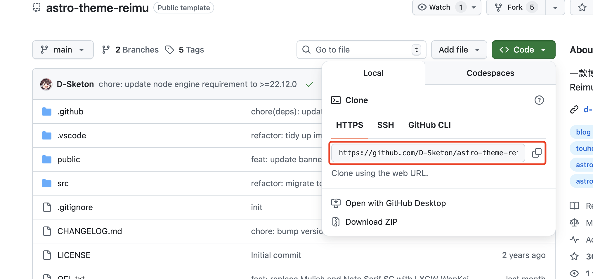
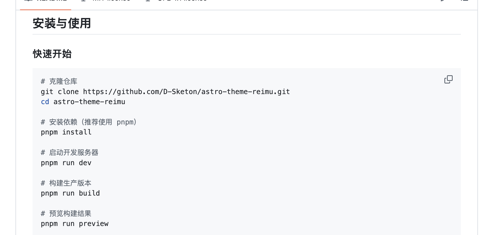
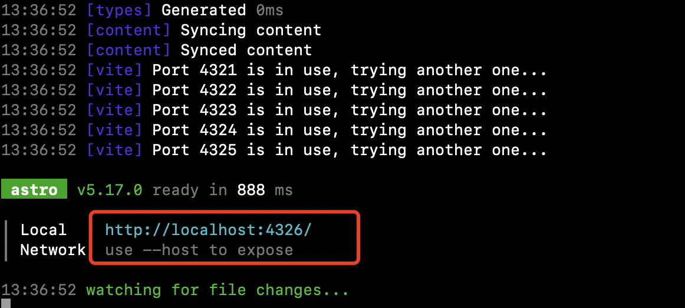
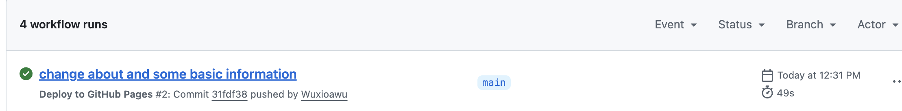

## 一、想法

我一直想搭建一个属于自己的个人博客，用来记录一些学习、思考和生活中的内容。  
之前其实也写过一些博客，但基本都是发布在第三方平台上。虽然第三方平台省心、省事，但总觉得**个人博客在稳定性和安全性上不如平台可靠**。

不过，随着 AI 的到来，我越来越清晰地意识到一件事：  
**个人独特性正在变得越来越重要。**

如果要长期沉淀和展示这种独特性，一个完全由自己掌控的平台显然是更好的选择，而个人博客正是其中一个不错的形式。

因此，我花了一些时间搭建了现在这个博客。  
这篇文章是博客的第一篇帖子，同时也是一篇**完整的搭建记录**。我会尽量写得详细一些，希望即使是**非专业人士**，也可以按照本文的步骤，顺利搭建出属于自己的博客。

---

## 二、选型与工具

在正式开始之前，先简单说一下博客框架的选型过程。

我之前用过 **Hexo** 搭建博客，但在这次重新尝试时遇到了一些问题：

- 很多主题比较老，基本是七八年前的产物  
- 本地使用的是较新的 Node.js 版本  
- 不少主题或插件已经不兼容，折腾成本偏高  

于是我干脆直接向 AI 咨询了目前**个人建站比较主流、且适合新项目的方案**。

我的核心需求其实很明确：

- 可以部署到 **GitHub Pages**  
- 不需要购买服务器  
- 技术栈相对现代，维护成本低  

综合对比之后，我最终选择了 **Astro**。

🔗 Astro 官网：https://astro.build/

---

### 主流静态博客框架对比

| 框架 | 技术栈 | 性能 / 构建 | 现代架构支持 | 互动组件 | 学习曲线 | 适用场景 |
| --- | --- | --- | --- | --- | --- | --- |
| **Astro** | JS / TS + 多框架支持 | 构建快 + 运行快，默认无 JS | ⭐⭐⭐⭐（组件岛架构） | ⭐⭐⭐（按需加载） | ⭐⭐ | 内容型博客、文档站 |
| **Hugo** | Go | 构建极快 | ⭐⭐ | ⭐ | ⭐⭐ | 内容密集型博客 |
| **Hexo** | Node.js | 构建快 | ⭐⭐ | ⭐（插件增强） | ⭐⭐ | 轻量博客 |
| **Jekyll** | Ruby | 中等 | ⭐⭐ | ⭐ | ⭐ | GitHub Pages 原生支持 |

最终选择 Astro 的原因很简单：  
**现代、性能好、对博客友好，而且部署到 GitHub Pages 非常成熟。**

---

## 三、搭建步骤

### 1️⃣ 寻找并选择模板

Astro 官方提供了主题市场：

🔗 Astro Themes：https://astro.build/themes

> **Step 1**  
> 访问 Astro Themes，选择一个你喜欢的主题（有免费的，也有付费的）。

> **Step 2**  
> 进入主题详情页后：
> - **Get Started**：跳转到该主题的 GitHub 仓库  
> - **Live Demo**：在线预览博客效果  

> **Step 3**  
> 进入 GitHub 仓库后，可以直接将项目 `git clone` 到本地。  
> 这里需要具备一些 Git 的基础知识，不熟悉的话可以先简单了解一下 Git 的基本用法。

---

### 2️⃣ 本地运行项目

> **Step 4**  
> 一般情况下，模板仓库都会在 `README.md` 中说明：
> - 所需的运行环境  
> - 依赖安装方式  
> - 本地启动命令  

务必先把本地环境配置好，再严格按照作者的说明运行项目。

> **Step 5**  
> 项目成功启动后，终端通常会给出一个本地访问地址（如 `http://localhost:3000`）。  
> 在浏览器中访问该地址，确认页面是否可以正常打开。

---

### 3️⃣ GitHub Pages 部署

相关官方文档：

- GitHub Pages：https://docs.github.com/en/pages/quickstart  
- GitHub Actions：https://docs.github.com/en/actions  

> **Step 6**  
> 在 GitHub 上创建一个新的仓库。  
> ⚠️ 注意：仓库名称需要符合 GitHub Pages 的命名规则，具体可参考官方文档。

> **Step 7**  
> 将本地代码推送到你自己的仓库中：
> - 修改 `git remote` 地址  
> - 确保代码成功 push  

同时在仓库设置中开启 **GitHub Pages**，并配置构建方式。

> **Step 8**  
> 配置 GitHub Actions 自动构建。  
> 可以直接参考 Astro 官方提供的部署指南：  
> https://www.astrojs.cn/en/guides/deploy/github/

当 Action 构建成功后，即可看到最终生成的访问地址。

---

## 四、结语

到这里，一个基于 **Astro + GitHub Pages** 的个人博客就算正式搭建完成了 🎉  

如果你也在考虑搭建个人博客，希望这篇文章能对你有所帮助。
