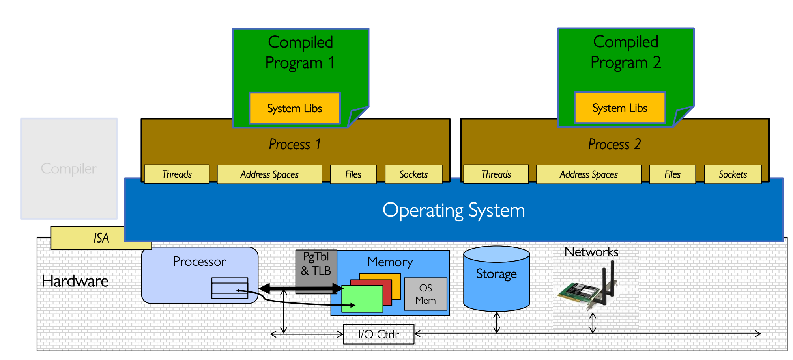
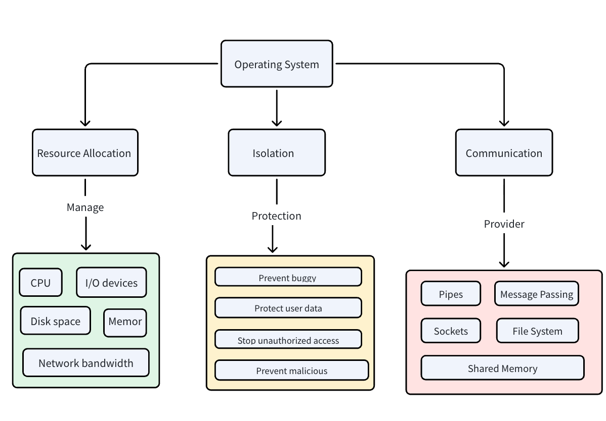
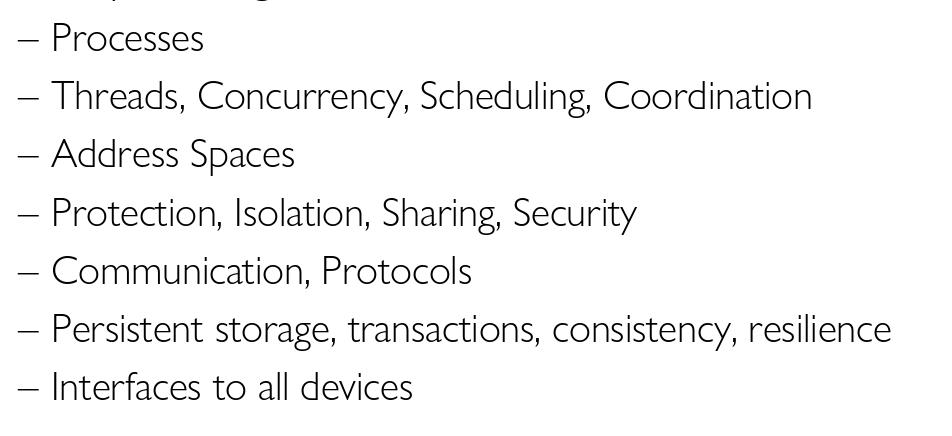

# 1. 定义

> [!定义]
>
> 操作系统运行在各种计算机系统中。有时它对终端用户是不可见的，例如嵌入式设备：  
> 烤面包机、游戏机，以及现代汽车和飞机内部的计算机。  
> 操作系统也是通用计算系统的重要组成部分，例如：智能手机、台式机和服务器。

---

> [!注意]
> • 裁判（Referee）—— 管理资源的保护、隔离与共享 → 资源分配与通信  
> • 幻术家（Illusionist）—— 提供易用的抽象 → 无限内存、独占机器 → 文件、用户、消息  
> • 胶水（Glue）—— 提供通用服务 → 存储、窗口系统、网络  
> → 目标：共享、授权、抽象

---

## 1. 资源分配（裁判角色）

---

## 2. 操作系统作为幻术家

.png "")

---

## 3. 通用服务：操作系统作为胶水

.png "")

---

# 2. 基本术语

---