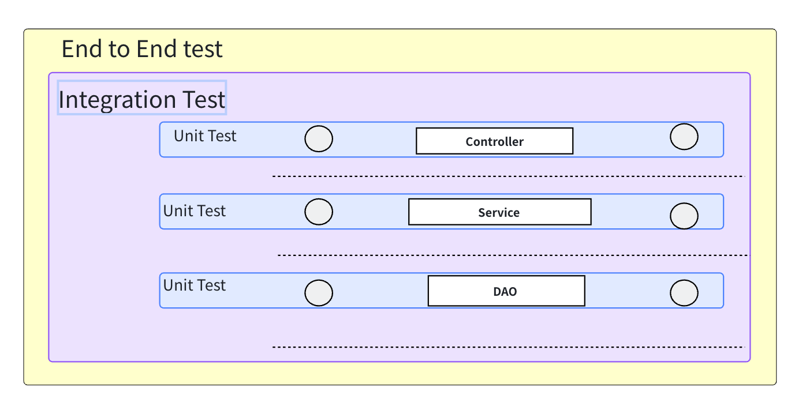
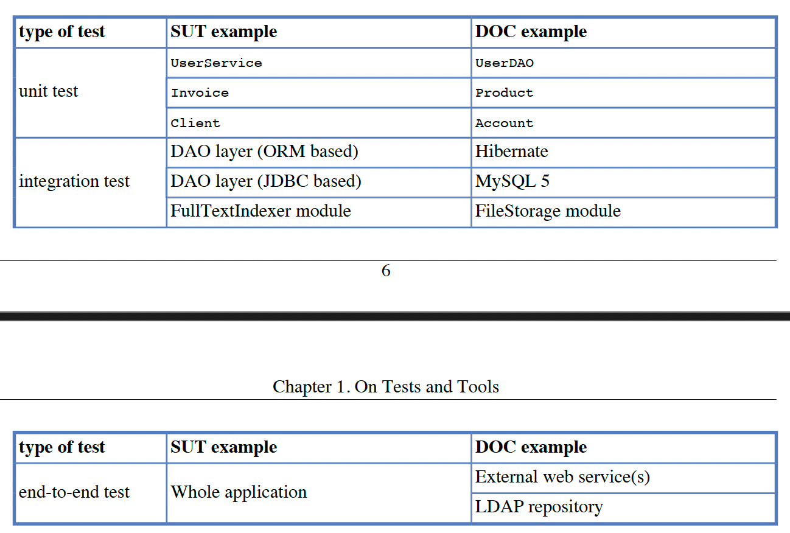

## 三种测试类型

本文介绍了三种开发中最重要的测试类型：

- **单元测试（Unit Test）** → 测试单个组件（重点）  
- **集成测试（Integration Test）** → 测试组件之间的交互  
- **端到端测试（End-to-End Test）** → 从用户视角测试整个系统  

---

## 单元测试（Unit Test）

**单元测试**专注于在隔离环境下测试一个类（或最小可测试单元）。  
其主要目的是确保代码在受控条件下能够正确运行。

---

## 集成测试（Integration Test）

**集成测试**关注系统中不同模块之间的正确协作，尤其是在与那些你无法控制的外部代码（例如框架或第三方服务）进行集成时，这一点尤为重要。

---

## 端到端测试（End-to-End Test）

**端到端测试**用于验证系统从用户角度是否正常工作。  
它会对整个系统进行测试，模拟真实用户的使用方式。

---

## 示例

- **SUT（System Under Test）**：被测试的系统或组件  
- **DOC（Depended On Component）**：SUT 依赖的其他组件  

